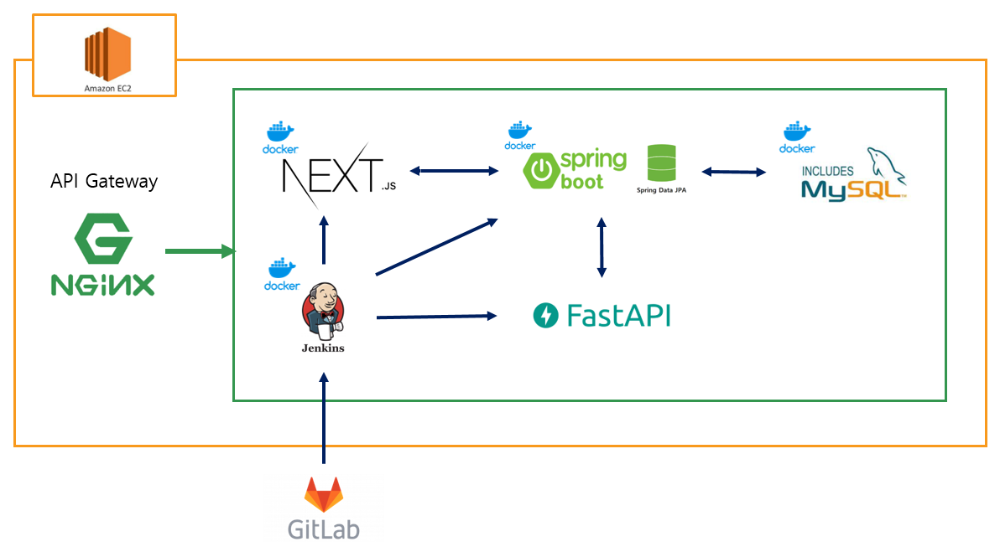
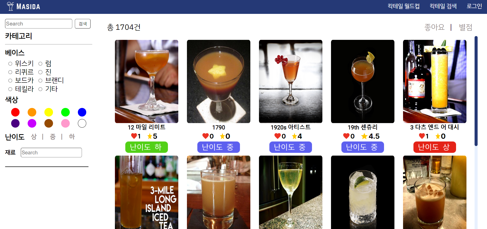
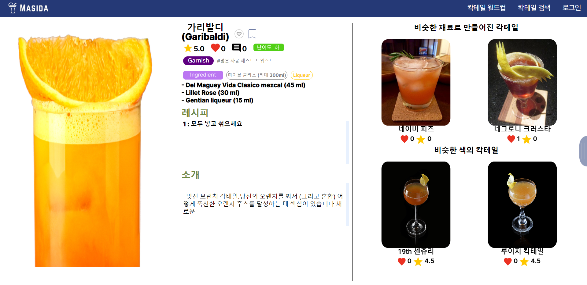
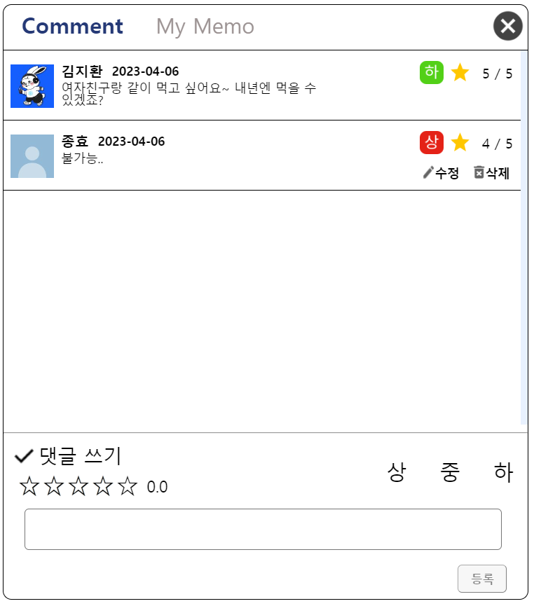
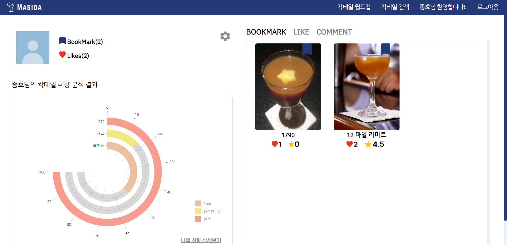
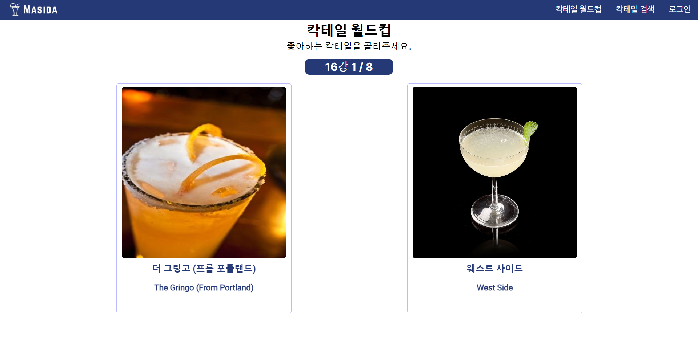
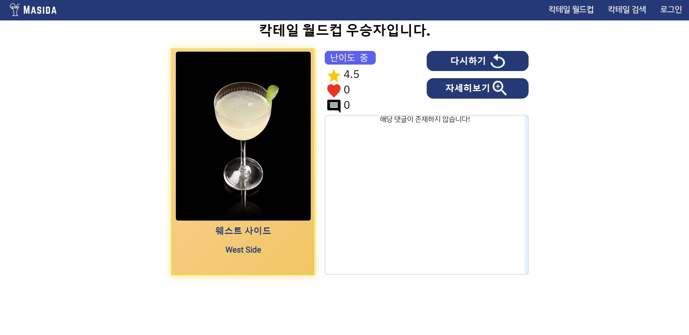
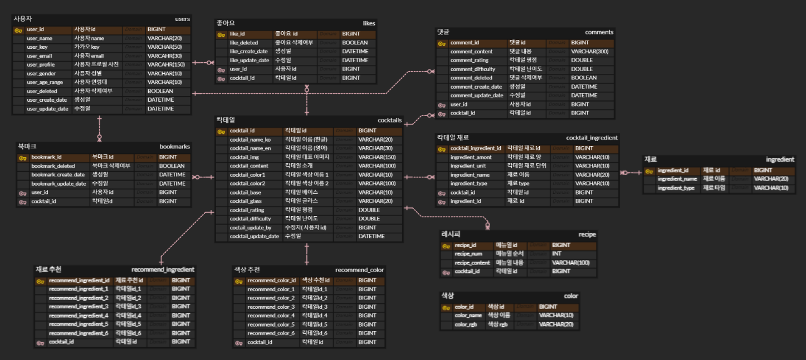

------------------------------------------

# 1. MASIDA 소개

  
  ### **당신의 취향을 그대로 담은 칵테일을 집에서도 손쉽게🍸**
    
  🌵 Naming : 마시다와 맛있다의 중의적인 표현
  
   | 늘어나는 혼술족과 칵테일을 다양하게 시도해보고 싶은 사용자를 위한 서비스, 
  
   | 칵테일 레시피를 찾고, 자신의 취향에 맞는 칵테일을 추천, 분석해주는 서비스.
  


------------------------------------------------------
  
# 2. 🔍 개발 환경
  
## 2-1. 환경 설정
    
  ### **👨‍💻 Front-end**
    
    - React 18.2.0

    - Node 18.12.1

    - npm 8.19.2

    - Next 13.2.3

  ### **👨‍💻 Back-end**

    - Java 11

    - SpringBoot 2.7.9
    
    - Python 3.9
      
    - Pycharm, Google Colab

    - Fast API

    - MySQL

    ※ [설치 파일](./back/pythonProject/requirements.txt/)
    
  ### **👩‍💻 CI/CD**  
    
    - AWS EC2
      
    - Jenkins
      
    - Docker 20.10.18
      
    - Docker-compose
      
  

## 2-2. 서비스 아키텍처
  

  
------------------------------------------------------
  

# 3. 📘 실행 방법
  
## docker를 활용한 실행 가이드
  
1. **git clone**
  
  ```bash
  git clone 
  ```
    
2. **[도커 설치](https://docs.docker.com/get-docker/) 및 도커 [컴포즈 설치](https://docs.docker.com/compose/install/)**
  
3. **Dockerfile 및 docker-compose.yml작성**
  
   - nginx Dockerfile
     ~~~docker
      FROM node:16.17.0 as builder
      # 작업 폴더로 소스 파일 복사
      COPY {git 폴더}/front/sharkshark /home/react
      WORKDIR /home/react
      # node 패키지 설치 후 빌드
      RUN npm install
      RUN npm run build
      FROM nginx
      # nginx 설정 복사
      COPY {nginx.conf 위치} /etc/nginx
      # 빌드 파일 복사
      COPY --from=builder /home/react/build /home/build
      # 포트 개방
      EXPOSE 80
      CMD ["nginx", "-g", "daemon off;"]
     ~~~

   - fastapi dockerfile
     ~~~docker
      FROM python:3.9
      # 작업 폴더로 실행 폴더 복사
      WORKDIR /code
      COPY {git 폴더}/back/pythonProject /code
      # 파이썬 패키지 설치 후 실행
      RUN pip install --no-cache-dir --upgrade -r /code/requirements.txt
      CMD ["uvicorn", "main:app", "--host", "0.0.0.0", "--port", "8000"]
     ~~~

   - nginx.conf 파일
     ~~~bash
      user nginx;
      worker_processes auto;
      events {
        worker_connections 1024;
      }
      http{
        include mime.types;
        access_log /var/log/nginx/access.log;
        error_log /var/log/nginx/error.log;
        
        server {
          // 포트 지정
          listen 80;
          listen [::]:80;
          
          // 프론트 빌드파일 경로설정
          location / {
            root	/home/build;
            index	index.html index.htm;
            try_files 	$uri $uri/ /index.html;
          }
          // 백엔드 api 요청 포워딩
          location /api/{
            proxy_pass http://172.17.0.1:8000/;
          }
        }
      }
     ~~~

   - docker-compose.yml

     ~~~yml
      version: '3'
      services:
        nginx:
          build:
            context: .
            dockerfile: {nginx dockerfile 이름}
          ports:
            - 80:80
        api:
          build:
            context: .
            dockerfile: {fastapi dockerfile 이름}
          ports:
            - 8000:8000
          extra_hosts:
            - "localhost:host-gateway"
     ~~~

4. **도커 컨테이너 실행**
   - mysql 이미지 실행하기

     ~~~bash
      # mysql 이미지 가져오기
      docker pull mysql
      # 컨테이너 실행
      docker run --name mysql -e MYSQL_ROOT_PASSWORD={password} -d -p 3306:3306 mysql
     ~~~
  
   - 3306포트로 mySQL 접속하여 b205 스키마 생성

   - docker-compose 실행

     ~~~bash
     docker compose up -d --build
     # 혹은
     docker-compose up -d --build
     ~~~


5. **작동 확인**

  - 실행 중인 컨테이너 조회

     ~~~bash
     docker ps
     ~~~
    
  - mySQL 접속하여 DB [덤프 파일](/exec/sharkshark_dp_dump.zip) 실행

--------------------------

  
  

# 4. 🦈 주요 기능
------------------------------------------------------
  
  1. 메인 배너

    -  메인 페이지의 배너를 통해 입문자, 봄, 여름, 칵테일의 재밌는 정보를 볼수 있습니다.

  2. 칵테일 검색



    - 검색 페이지에서 이름, 베이스, 색상, 난이도, 재료별로 검색이 가능하며 그 결과에 따라 처음엔 이름순으로 보여주며 좋아요, 별점순으로 나열이 가능합니다.
 
  3. 칵테일 상세 페이지



    - 상세페이지에서는 이 칵테일의 정보들에 대해서 볼수 있으며 정보는 별점과 좋아요, 댓글의 개수, 난이도, 재료, 레시피, 소개 정보 등이 왼쪽에 보여지며 오른쪽에는 상세페이지의 칵테일과 비슷한 재료로 만든, 색인 칵테일을 보여줍니다.
    - 로그인시 오른쪽의 버튼을 클릭하면 댓글 창을 띄워서 보여줍니다. 

  3-1. 댓글 모달



    - 다른 사람이 해당 칵테일에 대한 댓글을 볼 수 있으며 내가 단 댓글은 수정 및 삭제가 가능합니다. 해당 별점, 난이도를 매김에 따라 칵테일의 별점, 난이도가 변하며 댓글은 인당 1개씩만 작성 가능합니다.

  4. 마이 페이지



    - 로그인을 해야 들어 올 수 있는 구간입니다. 헤더에는 카카오톡 프로필의 이름을 띄워줍니다.
    - 페이지에서는 현재 나의 카카오톡 프로필 사진과 북마크, 좋아요 누른 것의 개수를 볼 수 있고 현재 내가 좋아요 누른 칵테일에 대한 분석을 아래에 보여줍니다.
    - 오른쪽에는 내가 북마크, 좋아요, 댓글이 있는 칵테일을 볼 수 있습니다. 그 칵테일을 누를시 칵테일 상세보기 페이지로 이동됩니다.
  
  5. 칵테일 월드컵



    - 월드컵 페이지로 오면 랜덤 칵테일 16개에 대해 월드컵을 진행하며 해당 칵테일에 마우스를 갖다 대면 카드가 뒤집어지며 해당 칵테일에 대한 설명이 나옵니다.

  5-1. 칵테일 월드컵(우승 칵테일)



    - 우승자라는 것을 보여주며 마찬가지로 칵테일에 마우스를 갖다 대면 카드가 뒤집어지며 설명이 나옵니다.
    - 이 칵테일의 난이도, 별점, 좋아요, 댓글의 수가 나오며 다시하기 버튼을 클릭시 월드컵을 16강부터 다시하며 상세보기 페이지로 갈수있는 자세히 보기 버튼도 있습니다.
    - 아래에는 댓글이 존재한다면 해당 칵테일에 대한 댓글을 보여주며 없을시 댓글이 존재하지 않는다고 나옵니다.


--------------------------


# 5. 🔍 추천 알고리즘
------------------------------------------------------
  - 재료 기반 칵테일 추천 & 색상 기반 칵테일 추천
    - 콘텐츠 베이스 알고리즘을 사용
      - BoW, TF-IDF, Cosine Similarity 을 활용하여 구현

  - 사용자의 베이스, 재료, 색상의 취향 그리고 연령대와 성별에 따른 칵테일 추천
    - 사용자와 비슷한 취향을 가진 사람들이 좋아요한 칵테일들을 추천

--------------------------


# 6. 🛡 배포
------------------------------------------------------
  - https
    - certbot 컨테이너를 함께 실행
    - letsencrypt ssl 인증서 발급
    - EC2 제공 도메인 'http://j8b208.p.ssafy.io/' 사용하여 인증
  - 자동 배포
    - Gitlab에서 web hook 설정을 통해 jenkins 빌드 유발
    - jenkins의 shell script 실행 기능을 이용하여 git pull, docker compose up 커맨드 실행
  
  
--------------------------
  
  

# 7. 📁 설계 문서
------------------------------------------------------
    
  ## 7-1. ERD

  


--------------------------


# 8. 🖊 Cooperation&Promises
------------------------------------------------------
  
  ## 8-1. Tools

    - Git

    - Jira

    - Notion

    - Mattermost

    - Webex
      
      
  
    
--------------------------


# 8. 👨‍👩‍👧‍👦  팀원 소개
------------------------------------------------------
  - 프론트엔드: 손종효, 김지환, 김영주
  - 벡엔드: 이지현, 강지수, 김주성
  
 
